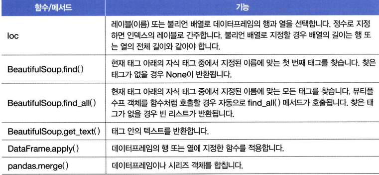
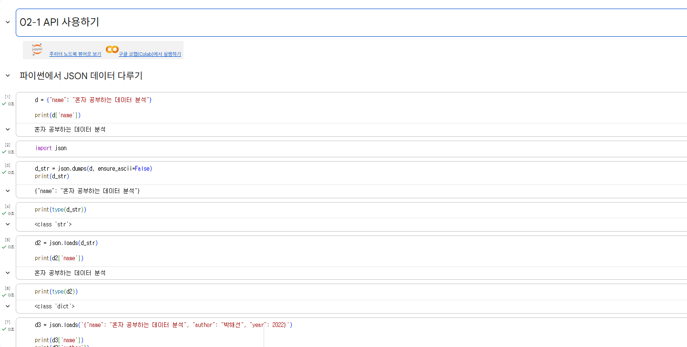
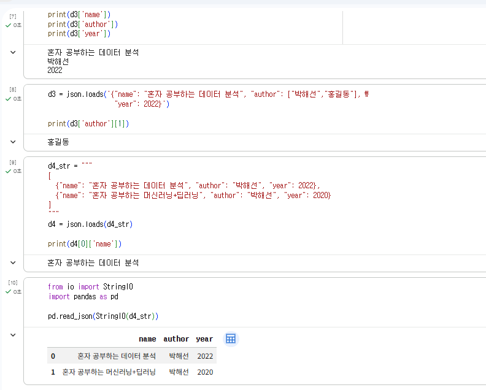
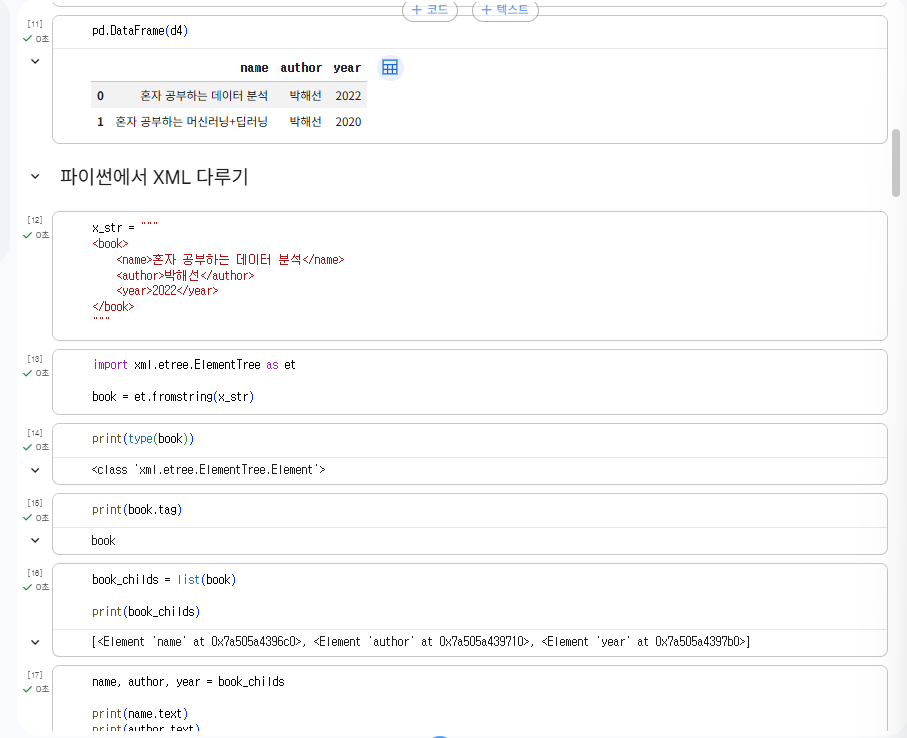
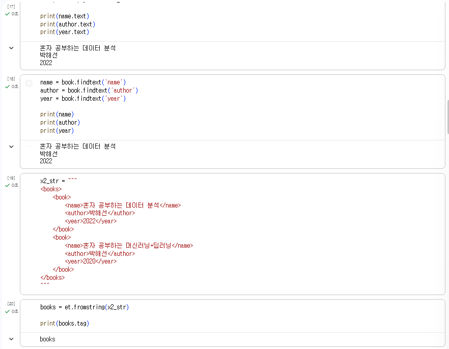
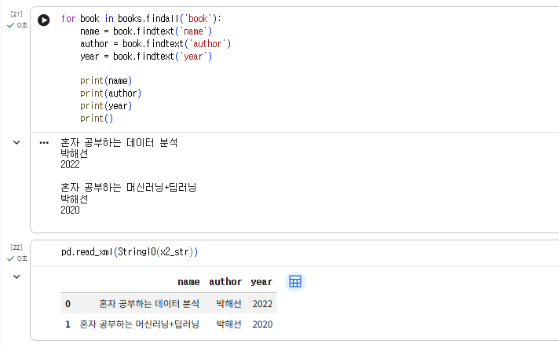

# 데이터분석 2주차 정규과제

📌데이터분석 정규과제는 매주 정해진 분량의 『*혼자 공부하는 데이터 분석 with 파이썬*』 을 읽고 학습하는 것입니다. 이번 주는 아래의 **DataAnalysis_2nd_TIL**에 나열된 분량을 읽고 공부하시면 됩니다.

아래의 문제를 풀어보며 학습 내용을 점검하세요. 문제를 해결하는 과정에서 개념을 스스로 정리하고, 필요한 경우 제시된 강의를 참고하여 보완하는 것이 좋습니다.

<!-- 강의 링크는 아래와 같습니다.
https://www.youtube.com/watch?v=s_-VvTLb3gs&list=PLVsNizTWUw7FGzSRCkQrPEEe-ljVXgS7k&index=4
https://www.youtube.com/watch?v=Il6L8OtNFpc&list=PLVsNizTWUw7FGzSRCkQrPEEe-ljVXgS7k&index=5
-->


## DataAnalysis_2nd_TIL

### 2장 데이터 수집하기
#### 01. API 사용하기
#### 02. 웹 스크래핑 사용하기


## Study Schedule

| 주차  | 공부 범위     | 완료 여부 |
| ----- | ------------- | --------- |
| 1주차 | p.24~81    | ✅         |
| 2주차 | p.84~151   | ✅         |
| 3주차 | p.154~219  | 🍽️         |
| 4주차 | p.222~279 | 🍽️         |
| 5주차 | p.282~325 | 🍽️         |
| 6주차 | p.328~379 | 🍽️         |
| 7주차 | p.382~430 | 🍽️         |

<br>

<!-- 여기까진 그대로 둬 주세요-->


# 1️⃣ 개념 정리 

## 01. API 사용하기

<API란?>
- 두 프로그램이 서로 대화하기 위한 방법을 정의한 것

웹 페이지를 전송하기 위한 통신 규약:HTTP
- 웹 브라우저가 웹 서버에 웹 페이지를 요청하고, 웹 서버는 요청에 맞는 웹 페이지를 웹 브라우저에게 전송

웹 페이지 문서: HTML
- 웹 브라우저가 화면에 표시할 수 있는 문서의 한 종류이자 웹 페이지를 위한 표준 언어

<JSON>
- 파이썬의 딕셔너리와 리스트를 중첩해놓은 것과 비슷함
- 파이썬 객체를 JSON 문자열로 변환: json.dumps()
- JSON 문자열을 파이썬 객체로 변환: json.load()

<XML>
- xml 패키지 사용하여 XML 문서에 있는 엘리먼트 탐색
- 판다스의 경우 read_xml() 함수 사용


## 02.웹 스크래핑 사용하기

<웹 스크래핑>
- 웹 사이트에서 필요한 데이터를 추출하는 기술
- 공개 API를 사용할 수 있는지 살펴보기

<뷰티플수프>
- HTML 문서를 파싱하는 데 사용하는 대표적인 파이썬 패키지
- requests 패키지로 가져온 HTML에서 원하는 태그나 텍스트를 찾는 기능 제공

<핵심함수>




# 2️⃣ 수행 인증








<br>
<br>

# 3️⃣ 확인 문제

## 문제 1.

> **🧚Q. 다음 중 BeautifulSoup 외에 웹 스크래핑에 사용할 수 있는 파이썬 패키지로 가장 적절한 것은 무엇인가요?**

```
1️⃣ NumPy  
2️⃣ Scrapy  
3️⃣ Matplotlib  
4️⃣ Scikit-learn  
```

2번
Scrapy는 파이썬에서 웹 스크래핑을 할 때 사용할 수 있는 대표적인 패키지 중 하나이다. 웹사이트에서 데이터를 자동으로 수집하고 구조화된 형태로 저장할 수 있도록 도와주는 프레임워크로, 크롤링과 데이터 추출 기능을 함께 제공한다. 반면 NumPy는 수치 계산, Matplotlib은 데이터 시각화, Scikit-learn은 머신러닝을 위한 라이브러리이기 때문에 웹 스크래핑 목적에는 적절하지 않다.


### 🎉 수고하셨습니다.
