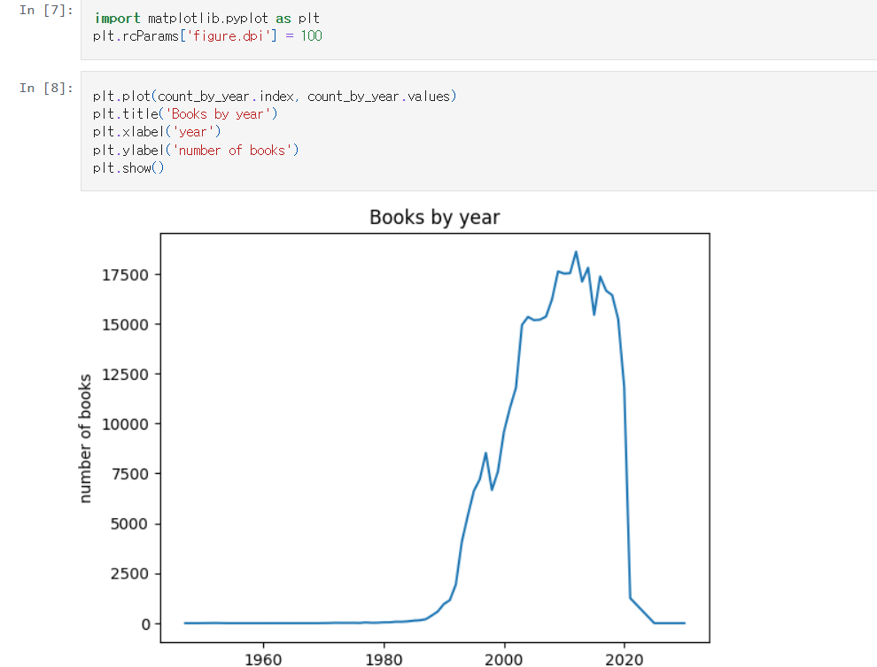
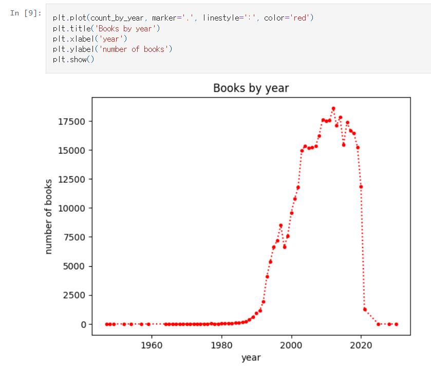
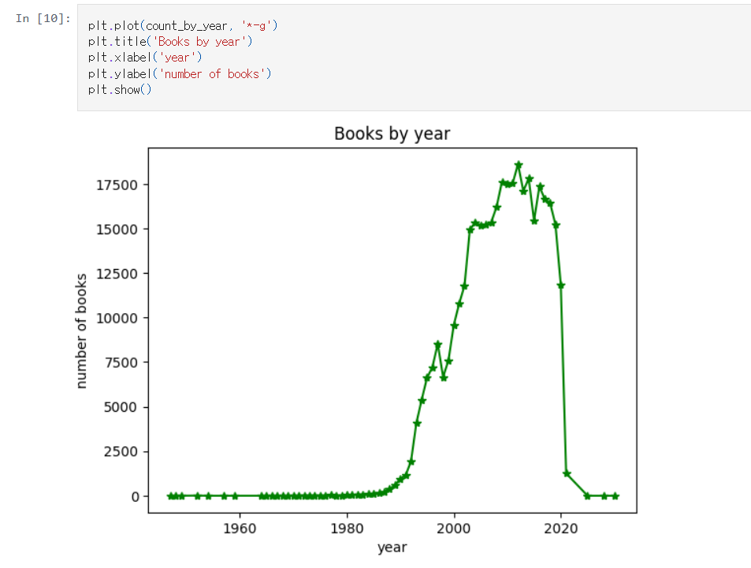
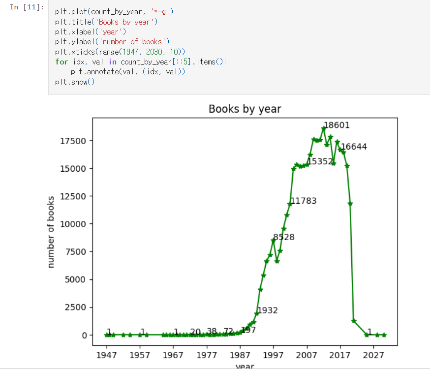

# 데이터분석 5주차 정규과제

📌데이터분석 정규과제는 매주 정해진 분량의 『*혼자 공부하는 데이터 분석 with 파이썬*』 을 읽고 학습하는 것입니다. 이번 주는 아래의 **DataAnalysis_5th_TIL**에 나열된 분량을 읽고 공부하시면 됩니다.

아래의 문제를 풀어보며 학습 내용을 점검하세요. 문제를 해결하는 과정에서 개념을 스스로 정리하고, 필요한 경우 제시된 강의를 참고하여 보완하는 것이 좋습니다.

<!-- 강의 링크는 아래와 같습니다.
https://www.youtube.com/watch?v=ho0LZ6GWhtc&list=PLVsNizTWUw7FGzSRCkQrPEEe-ljVXgS7k&index=10
https://www.youtube.com/watch?v=deYY4xHsI0o&list=PLVsNizTWUw7FGzSRCkQrPEEe-ljVXgS7k&index=11
-->


## DataAnalysis_5th_TIL

### 5장 데이터 시각화하기
#### 01. 맷플롯립 기본 요소 알아보기
#### 02. 선 그래프와 막대 그래프 그리기


## Study Schedule

| 주차  | 공부 범위     | 완료 여부 |
| ----- | ------------- | --------- |
| 1주차 | p.24~81    | ✅         |
| 2주차 | p.84~151   | ✅         |
| 3주차 | p.154~219  | ✅         |
| 4주차 | p.222~279 | ✅         |
| 5주차 | p.282~325 | ✅         |
| 6주차 | p.328~379 | 🍽️         |
| 7주차 | p.382~430 | 🍽️         |

<br>

<!-- 여기까진 그대로 둬 주세요-->


# 1️⃣ 개념 정리 

## 01. 맷플롯립 기본 요소 알아보기

- 피겨: 맷플롯립 그래프 요소를 모두 담고 있는 최상위 객체, 그래프 생성 시 자동 생성되며 다양한 옵션 제어 가능
- rcParams: 맷플롯립 그래프의 기본값을 관리하는 객체, 값 확인 및 변경 가능하며 이후 모든 그래프에 적용
- 축: 데이터 좌표를 표현하는 요소, 2차원은 2개·3차원은 3개의 축으로 구성, Axis 객체로 표현되며 Axes는 그래프 영역 의미
- 마커: 데이터 포인트를 표시하는 방법, 기본값은 ‘o’, rcParams 또는 scatter()의 marker로 변경 가능
- 서브플롯: 피겨 내부에 포함된 그래프 영역, Axes 객체로 구성되며 subplots() 함수로 여러 개 생성 가능

- pyplot.figure(): 피겨 객체를 만들어 반환
- pyplot.subplots(): 피겨와 서브플롯을 생성하여 반환
- Axes.set_xscale(): 서브플롯의 x축 스케일 지정
- Axes.set_yscale(): 서브플롯의 y축 스케일 지정
- Axes.set_title(): 서브플롯의 제목 설정
- Axes.set_xlabel(): 서브플롯의 x축 이름 지정
- Axes.set_ylabel(): 서브플롯의 y축 이름 지정


## 02. 선 그래프와 막대 그래프 그리기

- 선 그래프: 각 데이터 포인트를 직선으로 연결한 그래프, 선 스타일이나 마커 모양 변경 가능, 데이터값을 텍스트로 표현 가능
- 막대 그래프: 데이터 크기를 막대 높이로 나타낸 그래프, 주로 범주형 데이터에 사용, 가로 막대 그래프는 값이 클수록 길이가 길어짐

- pyplot.plot(): 선 그래프를 그림
- pyplot.title(): 그래프 제목 설정
- pyplot.xlabel(): x축 이름 지정
- pyplot.ylabel(): y축 이름 지정
- pyplot.xticks(): x축 눈금 위치와 레이블 지정
- pyplot.annotate(): 지정한 좌표에 텍스트 출력
- pyplot.bar(): 세로 막대 그래프 생성
- pyplot.barh(): 가로 막대 그래프 생성
- pyplot.imread(): 이미지 파일 읽기
- pyplot.imshow(): 이미지 출력
- pyplot.imsave(): 넘파이 배열을 이미지 파일로 저장
- pyplot.savefig(): 그래프를 이미지로 저장


# 2️⃣ 수행 인증

<!-- 교재에서 안내된 과정을 직접 실행해본 뒤, 진행 결과가 보이도록 4~6장의 스크린샷을 캡처하여 아래에 첨부해주세요.-->






<br>
<br>

# 3️⃣ 확인 문제

## 문제 1.

> **🧚Q. 다음 데이터를 이용하여 matplotlib으로 선그래프를 그리는 코드를 작성해주세요.**
- x = [1, 2, 3, 4, 5]
- y = [2, 4, 6, 8, 10]
> 조건은 아래와 같습니다.
```
1️⃣ 제목은 "Linear Trend"로 설정해주세요.
2️⃣ x축 이름은 "X values"로 설정해주세요.
3️⃣ y축 이름은 "Y values"로 설정해주세요.
4️⃣ 마커(marker)를 포함하여 선그래프를 그려주세요.
```

```
여기에 코드를 작성해주세요!
```
import matplotlib.pyplot as plt
데이터
x = [1, 2, 3, 4, 5]
y = [2, 4, 6, 8, 10]
그래프 그리기 (마커 포함)
plt.plot(x, y, marker='o')
제목 및 축 이름 설정
plt.title("Linear Trend")
plt.xlabel("X values")
plt.ylabel("Y values")
그래프 출력
plt.show()


### 🎉 수고하셨습니다.
