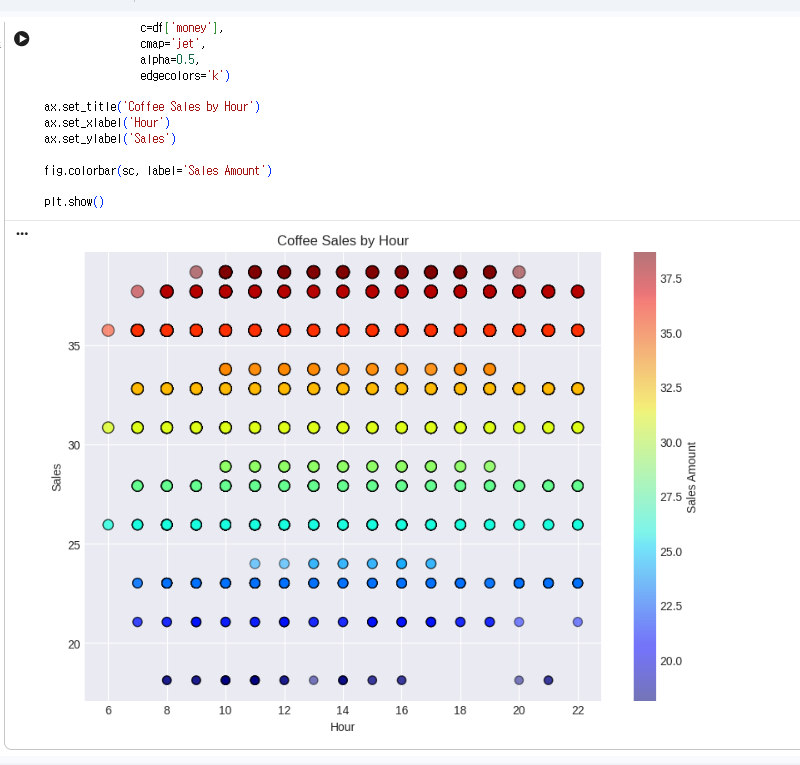

# 데이터분석 6주차 정규과제

📌데이터분석 정규과제는 매주 정해진 분량의 『*혼자 공부하는 데이터 분석 with 파이썬*』 을 읽고 학습하는 것입니다. 이번 주는 아래의 **DataAnalysis_6th_TIL**에 나열된 분량을 읽고 공부하시면 됩니다.

아래의 문제를 풀어보며 학습 내용을 점검하세요. 문제를 해결하는 과정에서 개념을 스스로 정리하고, 필요한 경우 제시된 강의를 참고하여 보완하는 것이 좋습니다.

<!-- 강의 링크는 아래와 같습니다.
https://www.youtube.com/watch?v=XD65UhBMOiI&list=PLVsNizTWUw7FGzSRCkQrPEEe-ljVXgS7k&index=12
https://www.youtube.com/watch?v=NTQ5NXelOfw&list=PLVsNizTWUw7FGzSRCkQrPEEe-ljVXgS7k&index=13
-->


## DataAnalysis_6th_TIL

### 6장 복잡한 데이터 표현하기
#### 01. 객체지향 API로 그래프 꾸미기
#### 02. 맷플롯립의 고급 기능 배우기


## Study Schedule

| 주차  | 공부 범위     | 완료 여부 |
| ----- | ------------- | --------- |
| 1주차 | p.24~81    | ✅         |
| 2주차 | p.84~151   | ✅         |
| 3주차 | p.154~219  | ✅         |
| 4주차 | p.222~279 | ✅         |
| 5주차 | p.282~325 | ✅         |
| 6주차 | p.328~379 | ✅         |
| 7주차 | p.382~430 | 🍽️         |

<br>

<!-- 여기까진 그대로 둬 주세요-->


# 1️⃣ 개념 정리 

## 01. 객체지향 API로 그래프 꾸미기

- Figure와 Axes 객체를 만든 뒤 메서드를 사용해 그래프를 그리는 방식
- subplots()로 객체 생성 후 ax.plot() 형태로 사용

[그래프 한글 설정]
- 코랩에서는 나눔 폰트를 설치한 뒤 사용
- rcParams, rc() 함수로 폰트와 DPI 설정 가능

[산점도 꾸미기]
- scatter() 함수 사용
- s: 마커 크기
- alpha: 투명도
- edgecolors: 테두리 색상
- c: 데이터 값에 따른 색상 지정

[컬러맵과 컬러막대]
- 컬러맵: 데이터 값을 색상으로 표현하기 위한 색상 목록
-   기본값: viridis
-   많이 사용하는 컬러맵: jet
- 컬러막대(colorbar): 색상이 어떤 값을 의미하는지 표시


## 02. 맷플롯립의 고급 기능 배우기

[여러개의 선 그래프]
- plot()을 여러 번 호출해 여러 선 그래프 표현
- legend()로 범례 추가

[스택영역그래프]
- 여러 데이터를 y축 방향으로 누적해 표현하는 그래프
- stackplot() 사용
- pivot_table()로 데이터 형태를 변환해 사용 가능

[막대그래프와 스택막대그래프]
- bar()로 막대 그래프 생성
- bottom 매개변수로 누적 막대 표현 가능
- cumsum()으로 누적합 계산 가능

[원그래프]
- 데이터 비율을 원 형태로 표현
- autopct로 비율 표시
- explode로 특정 항목 강조 가능

[서브플롯]
- 하나의 Figure 안에 여러 그래프 배치

[판다스로 그래프 그리기]
- plot.area() : 스택 영역 그래프
- plot.bar(stacked=True) : 스택 막대 그래프

# 2️⃣ 수행 인증

<!-- 교재에서 안내된 과정을 직접 실행해본 뒤, 진행 결과가 보이도록 4~6장의 스크린샷을 캡처하여 아래에 첨부해주세요.-->





# 3️⃣ 확인 문제

## 문제 1.

> **🧚Q. 이번 주차에는 확인문제 대신 그래프 그리기 실습을 진행합니다.
4주차에서 사용했던 캐글 데이터셋을 활용하여, 다양한 요소를 포함한 복잡한 그래프를 직접 작성해주세요.**

```
여기에 코랩 링크를 첨부해주세요!
(제출 전, 코랩의 공유 설정을 ‘링크가 있는 모든 사용자가 보기 가능’으로 변경했는지 반드시 확인해주세요.)
```


### 🎉 수고하셨습니다.
