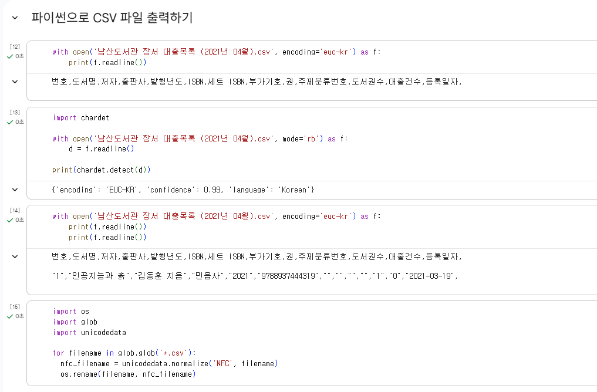
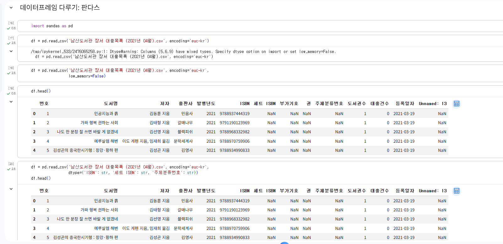
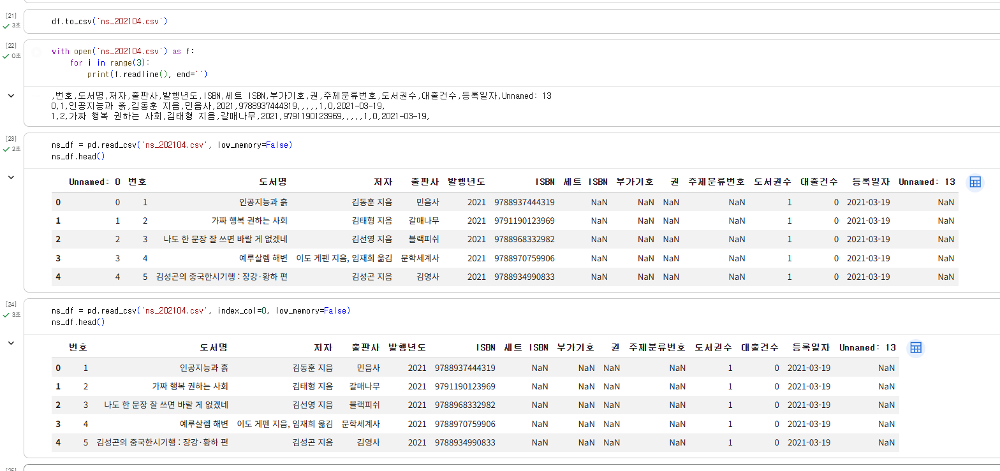
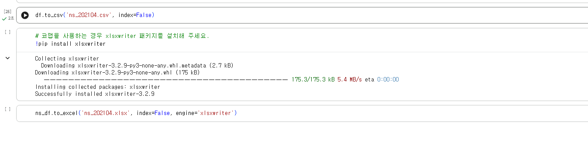

# 데이터분석 1주차 정규과제

📌데이터분석 정규과제는 매주 정해진 분량의 『*혼자 공부하는 데이터 분석 with 파이썬*』 을 읽고 학습하는 것입니다. 이번 주는 아래의 **DataAnalysis_1st_TIL**에 나열된 분량을 읽고 공부하시면 됩니다.

아래의 문제를 풀어보며 학습 내용을 점검하세요. 문제를 해결하는 과정에서 개념을 스스로 정리하고, 필요한 경우 제시된 강의를 참고하여 보완하는 것이 좋습니다.

<!-- 강의 링크는 아래와 같습니다.
https://www.youtube.com/watch?v=qGE_rT_oQaQ&list=PLVsNizTWUw7FGzSRCkQrPEEe-ljVXgS7k
https://www.youtube.com/watch?v=tp9XmeaHU0E&list=PLVsNizTWUw7FGzSRCkQrPEEe-ljVXgS7k&index=2
https://www.youtube.com/watch?v=D46j-e_IHlI&list=PLVsNizTWUw7FGzSRCkQrPEEe-ljVXgS7k&index=3
-->


## DataAnalysis_1st_TIL

### 1장 데이터 분석을 시작하며
#### 01. 데이터 분석이란
#### 02. 구글 코랩과 주피터 노트북
#### 03. 이 도서가 얼마나 인기가 좋을까요?


## Study Schedule

| 주차  | 공부 범위     | 완료 여부 |
| ----- | ------------- | --------- |
| 1주차 | p.24~81    | ✅         |
| 2주차 | p.84~151   | 🍽️         |
| 3주차 | p.154~219  | 🍽️         |
| 4주차 | p.222~279 | 🍽️         |
| 5주차 | p.282~325 | 🍽️         |
| 6주차 | p.328~379 | 🍽️         |
| 7주차 | p.382~430 | 🍽️         |

<br>

<!-- 여기까진 그대로 둬 주세요-->


# 1️⃣ 개념 정리 

## 01. 데이터 분석이란

- 데이터 분석: 유용한 정보를 발견하고 결론을 유추하거나, 의사결정을 돕기 위해 데이터를 조사, 정제, 변환, 모델링하는 과정
- 데이터 과학: 통계학, 데이터분석, 머신러닝, 데이터마이닝 등을 아우르는 큰 개념

-> 데이터 분석은 올바를 의사결정을 돕기위한 **통찰**을 제공하는 데 초점, 데이터 과학은 한 걸음 더 나아가 문제해결을 위한 최선의 **솔루션**을 만드는 데 초점

- 데이터 마이닝: 데이터에서 패턴 혹은 지식을 추출하는 작업
- 머신러닝: 데이터에서 자동으로 규칙을 학습하여 문제를 해결하는 소프트웨어를 만드는 기술 (EX, 딥러닝)


## 02. 구글 코랩과 주피터 노트북

- 구글코랩: 웹 브라우저에서 무료로 파이썬 프로그램을 테스트하고 저장하는 서비스

- 셀: 실행 최소 단위
- 텍스트 셀에는 HTML, 마크다운 혼용 가능
- 코드 셀: 파이썬 코드를 입력하고 실행

## 03. 이 도서가 얼마나 인기가 좋을까요?

- 파이썬으로 csv 파일 출력: with open(‘남산도서관 장서 대출목록 (2021 년 04월).csv‘) as f: 
print(f.readline())
- 파일 인코딩 형식 확인: chardet.detectO 함수
- 인코딩 형식 저장:  encoding 매개변수로 인코딩 형식을 ‘EUC-KR로 지정

<판다스>
- csv 파일을 읽어 데이터프레임 표 형식 데이터로 저장
- csv 파일 읽을 때는 read_csv() 함수
- 판다스에서 데이터 프레임을 csv로 저장할 때는 to_csv() 메서드

# 2️⃣ 수행 인증









<br>
<br>

# 3️⃣ 확인 문제

## 문제 1.

> **🧚Q. 데이터 분석의 개념을 넓은 의미와 좁은 의미로 나누어 설명하고, 두 개념의 차이점도 함께 정리해주세요.**


```
여기에 답을 작성해주세요!
```


### 🎉 수고하셨습니다.
